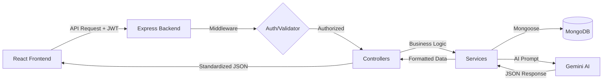

# InterviewIQ – AI Interview Preparation Platform 🧠🚀

**InterviewIQ** is a high-fidelity, production-grade interview preparation platform that leverages state-of-the-art AI to transform how candidates practice for job interviews. Unlike generic question banks, InterviewIQ parses your **actual resume** and generates **personalized interview sessions** tailored to your target role, difficulty level, and specific technical domains.

---

## 🎯 Project Overview

InterviewIQ solves the "cold start" problem in interview preparation. By integrating **Google Gemini AI**, the platform creates a feedback loop where candidates are not only asked relevant questions but are also evaluated in real-time with actionable feedback, scoring, and improvement suggestions.

### Key Highlights
- **Resume-Driven Intelligence**: AI analyzes your projects, skills, and experience to ask questions a real interviewer would.
* **Intelligent Caching**: Reusable `InterviewSession` architecture avoids redundant AI calls, ensuring efficiency and speed.
* **Deep Tech Specialization**: Configurable focus on DSA, DBMS, OS, Computer Networks, SQL, OOPs, and System Design.
* **Comprehensive Evaluation**: Every answer is scored (0-10) with detailed "Missing Points" and "Improvement Suggestions".
* **Data-Driven Analytics**: Visualize your performance trends, identify weak areas, and receive personalized recommendations.

---

## 🚀 Features

### 🔐 Authentication & Security
*   **Secure Access**: Full JWT-based authentication flow with protected routes.
*   **Password Hashing**: Industry-standard encryption using `bcryptjs`.
*   **Persistent Sessions**: Secure token management in localStorage with automatic logout on expiration.

### 📄 Resume Management System
*   **Multi-Format Support**: Upload PDF or .txt resumes.
*   **AI Parsing**: Real-time extraction of skills, roles, and experience.
*   **Management Dashboard**: View uploaded content, preview files, or update your profile context.

### 🤖 Advanced AI Interview Engine
*   **Context-Aware Setup**: Configure Role, Difficulty (Easy/Medium/Hard), and Question Distribution.
*   **Balanced Interviews**: Customizable mix of **Technical, HR, Behavioral,** and **Aptitude** questions.
*   **Topic Focus**: Multi-select technical categories to drill down into specific interview domains.
*   **Session Reuse**: Smart caching logic that persists your interview set until you decide to "Regenerate".

### ⏱️ Mock Interview Mode
*   **Timed Pressure**: Enable "Mock Mode" to activate a per-question timer.
*   **Auto-Submit**: Automatic submission of answers when the timer expires to simulate high-pressure scenarios.

### 📊 Analytics & Insights
*   **Performance Tracking**: Visual charts showing score trends over time.
*   **Topic Mastery**: Radar charts or bars highlighting performance in specific categories (e.g., SQL vs. DSA).
*   **Smart Recommendations**: AI-generated advice based on your historical performance and weak areas.

---

## 🛠️ Tech Stack

### Frontend
- **Framework**: [React 18](https://reactjs.org/) + [Vite](https://vitejs.dev/)
- **Language**: TypeScript
- **Styling**: [Tailwind CSS](https://tailwindcss.com/) + [Shadcn UI](https://ui.shadcn.com/)
- **Animations**: [Framer Motion](https://www.framer.com/motion/)
- **State Management**: [TanStack React Query](https://tanstack.com/query/latest)
- **Charts**: [Recharts](https://recharts.org/)

### Backend
- **Runtime**: [Node.js](https://nodejs.org/)
- **Framework**: [Express.js](https://expressjs.com/)
- **Database**: [MongoDB](https://www.mongodb.com/) (via [Mongoose](https://mongoosejs.com/))
- **AI Integration**: [Google Generative AI (Gemini Flash)](https://ai.google.dev/)
- **Validation**: [Joi](https://joi.dev/)
- **File Handling**: [Multer](https://github.com/expressjs/multer), [pdf-parse](https://www.npmjs.com/package/pdf-parse), [mammoth](https://www.npmjs.com/package/mammoth)

---

## 🏗️ System Architecture

InterviewIQ follows a modular, service-oriented architecture:



### Data Flow
1.  **Frontend**: User configures interview settings.
2.  **API Layer**: Requests sent to backend with JWT in headers.
3.  **Controllers**: Handle request routing and response formatting.
4.  **Services**: Decoupled logic for AI generation, resume parsing, and analytics.
5.  **AI Layer**: Prompt Engineering optimizes Gemini's output into strict, parseable JSON.
6.  **Persistence**: Questions, answers, and sessions stored in MongoDB for future analytics.

---

## 📂 Folder Structure

### Backend
```text
backend/
├── config/             # DB connection and seed scripts
├── controllers/        # Request handlers (Auth, Resume, Questions, etc.)
├── middleware/         # Auth protection, error handling, Joi validation
├── models/             # Mongoose Schemas (User, Resume, Answer, etc.)
├── routes/             # Express Route definitions
├── services/           # Core Logic (AI Integration, Resume Parsing)
├── uploads/            # Statically served resume files
└── utils/              # Shared utilities (Logger)
```

### Frontend
```text
frontend/src/
├── components/         # Reusable UI components & Layouts
├── hooks/              # Custom React hooks (useToast, etc.)
├── pages/              # Main route views (Dashboard, Interview, etc.)
├── services/           # Axios API service definitions
└── lib/                # Utility functions and Tailwind merging
```

---

## 📑 API Documentation

### Authentication
| Endpoint | Method | Purpose | Auth Required |
| :--- | :--- | :--- | :--- |
| `/api/auth/signup` | POST | Register new user | No |
| `/api/auth/login` | POST | Login and receive JWT | No |

### Resume Management
| Endpoint | Method | Purpose | Auth Required |
| :--- | :--- | :--- | :--- |
| `/api/resume/upload` | POST | Upload PDF/TXT resume | Yes |
| `/api/resume/me` | GET | Get latest resume + extracted text | Yes |
| `/api/resume` | GET | List all resumes | Yes |
| `/api/resume/:id` | DELETE | Remove a resume record | Yes |

### Interview Engine
| Endpoint | Method | Purpose | Auth Required |
| :--- | :--- | :--- | :--- |
| `/api/questions` | POST | Get/Generate cached questions | Yes |
| `/api/questions/mock` | POST | Start timed mock session | Yes |
| `/api/answers` | POST | Submit answer for AI evaluation | Yes |

### Analytics
| Endpoint | Method | Purpose | Auth Required |
| :--- | :--- | :--- | :--- |
| `/api/analytics` | GET | Performance breakdown & Recs | Yes |

---

## 🗄️ Database Models

*   **User**: Core identity (Name, Email, Hashed Password).
*   **Resume**: Linked to `User`; stores file paths and extracted AI context.
*   **Question**: Global repository of AI-generated questions.
*   **Answer**: User submissions with associated AI scores and feedback.
*   **InterviewSession**: Caching model; maps `userId` + `role` + `config` to a set of `questions`.

---

## 🤖 AI Workflow (Gemini Integration)

### Question Generation
We use **Prompt Engineering** to guide Gemini in generating a balanced set of questions. The system sends:
- Extracted Resume Text
- Difficulty Level Constraints
- Distribution Weights (e.g., 5 Technical, 2 HR)
- Technical Topic Selection

### AI Caching Strategy
To reduce API costs, the system checks for an active `InterviewSession`. If the user hasn't changed their role, difficulty, or requested a "Fresh Generation", the system retrieves questions from MongoDB instead of calling Gemini.

---

## ⚙️ Local Development Setup

### Prerequisites
- Node.js (v18.x or higher)
- MongoDB (Local or Atlas instance)
- Google Gemini API Key

### 1. Clone & Install
```bash
git clone https://github.com/yourusername/InterviewIQ.git
cd InterviewIQ
npm run install:all
```

### 2. Environment Configuration
Navigate to the `backend/` folder and create a `.env` file:
```env
PORT=5000
MONGO_URI=your_mongodb_connection_string
JWT_SECRET=your_jwt_secret_key
GEMINI_API_KEY=your_google_ai_key
```

### 3. Run the Platform
From the **root directory**, run:
```bash
npm run dev
```
*Backend runs on `http://localhost:5000`*
*Frontend runs on `http://localhost:5173`*

---

## ⚠️ Troubleshooting

- **CORS Errors**: Ensure `origin` in `backend/server.js` matches your frontend port.
- **AI Parsing Issues**: If Gemini returns malformed JSON, our robust `parseAIResponse` utility usually cleans it, but check your API key quota.
- **Resume Extraction**: Ensure PDFs are text-based. Scanned images require OCR which is not yet supported.

---

## 🔮 Future Roadmap
*   **🎙️ Speech-to-Text**: Voice-based answers for more realistic practice.
*   **📹 Video Analysis**: AI-driven body language and sentiment tracking.
*   **🧠 Adaptive Difficulty**: Automatically increasing difficulty as score improves.
*   **🔗 Job Match**: Scraping real LinkedIn/Indeed descriptions for custom practice.

---

## 👨‍💻 Contributors
- **Maridul Walia** - *Lead Architect & Full Stack Engineer*

---
*Developed with ❤️ for the future of career preparation.*
